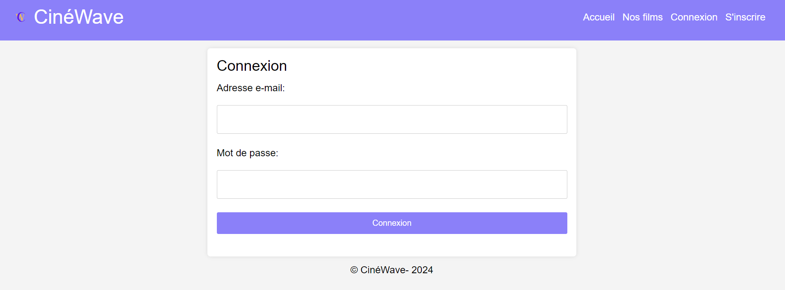
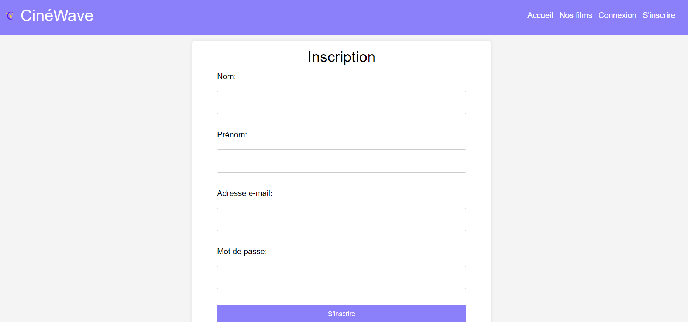
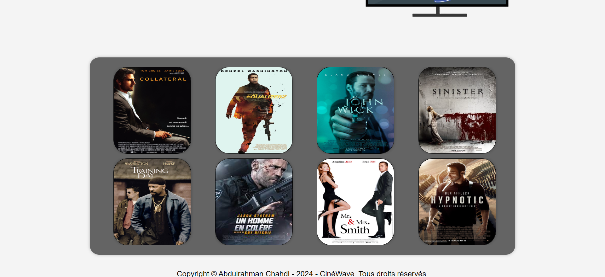

#  Présentation Ciné Wave

Voici un projet scolaire qui consiste à réaliser un site web proposant un système de streaming de films et de series de genres différents(horreur, action, thriller...). 
Ce projet contient une page d'accueil, une page de connexion, d'inscription, ainsi que des pages pour afficher les films lorsque nous sommes "abonnés".

# Interface graphique
## Connexion

## Inscription

## Nos Films

# Rendu 

[Cliquez pour avoir le rendu complet de ce projet](https://abdulrahman92c.github.io/projet_streaming/)

# Auteur
&copy; Abdulrahman Chahdi - 2024 - Bachelor CDA - ITIC Paris 